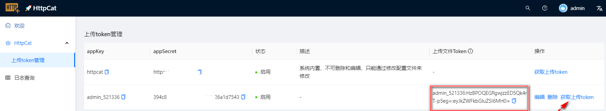

[English](../README.md) | 简体中文
## 🚀HttpCat 概述

HttpCat 是一个基于go实现的 HTTP 的文件传输服务，旨在提供简单、高效、稳定的文件上传和下载功能。

项目目标：一个可靠、高效、易用的HTTP文件传输瑞士军刀,它将大大提高你的文件传输控制力和体验。
无论是临时分享还是批量传输文件,HttpCat都将是你的优秀助手。

## 💥功能特点
* 简单易用
* 无需外部依赖，易于移植

## 🎉安装
解压到httpcat目录:
```bash
tar -zxvf httpcat_*.tar.gz -C httpcat
```

修改配置文件:
```bash
cd httpcat
vi ./conf/svr.yml
```

linux下运行:
```bash
./httpcat -C conf/svr.yml
```

windows下运行:
```bash
httpcat.exe --upload /home/web/website/download/ --download /home/web/website/download/ -C F:\open_code\httpcat\server\conf\svr.yml
```

```bash
# ./httpcat -h
Usage of ./httpcat:
  -C, --config string     ConfigPath (default "./conf/svr.yml")
      --download string   指定下载文件的路径,右斜线结尾 (default "./website/download/")
  -P, --port int          host port.
      --static string     指定静态资源路径(web) (default "./website/static/")
      --upload string     指定上传文件的路径,右斜线结尾 (default "./website/upload/")
```

### 使用tmux运行在后台
可以利用tmux方式后台运行:
```bash
Create a new tmux session using a socket file named tmux_httpcat
$ tmux -S tmux_httpcat

# 进入tmux后，可以执行运行命令,如：
httpcat --static=/home/web/website/upload/  -C server/conf/svr.yml

Move process to background by detaching
Ctrl+b d OR ⌘+b d (Mac)

To re-attach
$ tmux -S tmux_httpcat attach

Alternatively, you can use the following single command to both create (if not exists already) and attach to a session:
$ tmux new-session -A -D -s tmux_httpcat

To delete farming session
$ tmux kill-session -t tmux_httpcat
```

### linux可以使用systemd运行在后台
```bash
cp  httpcat.service /usr/lib/systemd/system/httpcat.service
systemctl daemon-reload
systemctl start httpcat
```

> 注意：根据你的业务需要修改启动参数
> 比如：一个最简单的应用场景：3个目录一致(则上传目录就是下载目录，并且也是web前端目录，可以无认证直接下载):
```bash
vi httpcat.service
```
```
ExecStart=/usr/local/bin/httpcat  --static=/home/web/website/upload/  --upload=/home/web/website/upload/ --download=/home/web/website/upload/  -C /etc/httpdcat/svr.yml
```

## httpcat前端
新版本增加了前端页面，前端采用独立发布形式，根据需要，用户选择下载。
因为httpcat自带静态资源文件处理，用户可以自由选择是否使用前端页面。

本前端是单页面应用，生产环境静态资源走 static 路由，api接口走 api 路由。如果用户自搭nginx，注意配置 /static 路由到静态资源目录，/api 路由到 httpcat 服务。

下载前端发布文件，解压到web目录，httpcat 会自动加载web目录下的静态资源文件。
httpcat web目录由配置文件中的static指定，如果不指定，默认为当前目录下的 website/static目录。
或者使用命令行参数指定，如：
```bash
--static=/home/web/website/httpcat_web/
```

### 前端部署
1. 下载前端独立发布文件，如 httpcat_web_v0.0.7.zip
2. 解压到web目录
   Assuming the web directory configured for httpcat is:  `/home/web/website/httpcat_web/`
    ```bash
       cd /home/web/website/
       unzip httpcat_web_v0.0.9.zip
       mv  dist httpcat_web
    ```
3. 启动httpcat服务
   启动服务需要指定web界面目录，使用 --static 参数指定，如：
    ```bash
    ./httpcat --static=/home/web/website/httpcat_web/  -C conf/svr.yml
    ```
4. 访问httpcat 前端服务
    ```bash
    http://127.0.0.1:8888
    ```

## ❤使用技巧
### 文件操作相关接口
#### 使用curl工具上传文件
```bash
curl -v -F "f1=@/root/hello.mojo" -H "UploadToken: httpcat:dZE8NVvimYNbV-YpJ9EFMKg3YaM=:eyJkZWFkbGluZSI6MH0=" http://localhost:8888/api/v1/file/upload
```
使用了 `curl` 命令来向指定的 URL 发送一个 `multipart/form-data` 格式的 POST 请求。下面是对每部分的解释：
- `curl`: 一个用来与服务器端进行数据传输的工具，支持多种协议。
- `-v`: 在命令执行时输出详细的操作信息，即 verbose 模式。
- `-F "f1=@/root/hello.mojo"`: 指定了要发送的表单数据。`-F` 选项表示要发送一个表单，`f1=@/root/hello.mojo` 表示要上传的文件字段名为 `f1`，文件路径为 `/root/hello.mojo`。这个字段的值是指向本地文件的相对或绝对路径。
- `http://localhost:8888/api/v1/file/upload`: 要发送请求到的 URL，这条命令会将文件上传到这个 URL。
- `-H "UploadToken: httpcat:dZE8NVvimYNbV-YpJ9EFMKg3YaM=:eyJkZWFkbGluZSI6MH0="`: 上传token，根据app_key、app_secret生成独立的上传token凭证。上传文件时候，附带上传token，服务端会校验token是否合法。

> 注意： f1 为服务端代码定义的，修改为其他，如file，会报错上传失败。


#### 上传文件认证：上传token
如果配置文件开启了 `enable_upload_token`，那么上传文件需要认证，需要在请求头中添加 上传token，token的值为配置文件中的`enable_upload_token`值。
根据app_key、app_secret生成独立的上传token凭证。上传文件时候，附带上传token，服务端会校验token是否合法。

上传token，根据app_key、app_secret生成。系统会根据配置文件内置一个app_key、app_secret。

> 注意：系统内置的app_key、app_secret，只能通过svr.yml来修改，不能通过界面修改，重启httpcat会加载系统内置的app_key、app_secret。

如：svr.yml文件中配置如下：
```darcs
app_key: "httpcat"
app_secret: "httpcat_app_secret"
```
除了系统内置的app_key、app_secret，还可以通过界面添加自定义的app_key、app_secret，
可以通过界面根据app_key、app_secret生成上传token。
如下图，可以通过点击“生成上传token”按钮，获取上传token。


#### 上传文件企业微信webhook通知
配置svr.yml文件中的`persistent_notify_url`，上传成功后，会发送企业微信通知。

通知信息如下：
```
有文件上传归档,上传信息：
- IP地址：192.168.31.3
- 上传时间：2023-11-29 23:07:04
- 文件名：syslog.md
- 文件大小：4.88 KB
- 文件MD5：8346ecb8e6342d98a9738c5409xxx
```

#### 支持sqlite保留上传历史记录
如果配置开启了 enable_sqlite，那么上传文件会记录到sqlite数据库中，可以通过sqlite3命令行工具查询上传历史记录。


使用sqlite3命令行工具创建数据库，查询数据
```bash
sudo apt install sqlite3
sqlite3 --version
```

运行以下命令启动 sqlite3 工具，并指定要创建的数据库文件名（例如 mydatabase.db）：
```bash
sqlite3 sqlite.db
```

在 sqlite3 提示符下，输入 `.tables` 命令来列出数据库中的所有表：
```bash
.tables
```

```bash
SELECT * FROM notifications;
```

#### 下载文件
下载某个特定文件:
```bash
wget -O syslog222 http://{{ip}}:{{port}}/api/v1/file/download?filename=syslog222
```
当您使用 wget 命令下载文件时，文件的名称由请求 URL 中的文件名部分确定。由于 URL 参数的存在，wget 命令可能会将整个 URL 当做文件名。
为了确保下载的文件名正确，您可以使用 -O 参数来指定文件名：

### p2p相关接口
需要配置文件开启p2p功能，默认关闭

#### 通过http接口向p2p网络发送消息
```bash
http://{{ip}}:{{port}}/api/v1/p2p/send_message
POST
{
"topic": "httpcat",
"message": "ceshi cccccccccccc"
}
```


## 💪TODO
1. HTTPS support

Feel free to raise an issue. Good luck! 🍀

## 🍀 FAQ
### 忘记密码怎么办？
如果忘记密码，可以修改sqlite数据库，删除admin用户，重启httpcat服务，会重新创建admin用户。
或者直接删除sqlite数据库，重启httpcat服务，会重新创建sqlite数据库。

默认的sqlite数据库路径，由配置文件中的sqlite_db_path指定，默认为：`./data/sqlite.db`，可以通过配置文件修改sqlite数据库路径。

我们找到这个文件，并删除这个文件,然后重启httpcat即可。
```bash
find / -name sqlite.db
rm xxx/sqlite.db
```

## 📝License
1. 本软件仅供个人使用，禁止用于商业目的。
2. 本软件的复制、分发、修改和使用应遵循以下条件：
   - 禁止用于商业目的。
   - 禁止将本软件用于任何商业产品或服务。
   - 保留软件中的版权和许可声明。
   - 除非获得明确的书面许可，禁止修改或删除软件中的版权和许可声明。
3. 本软件按 "原样" 提供，作者不承担任何明示或暗示的保证和责任。
4. 如果您使用了本软件，即表示您已接受此许可协议。

Good luck! 🍀
